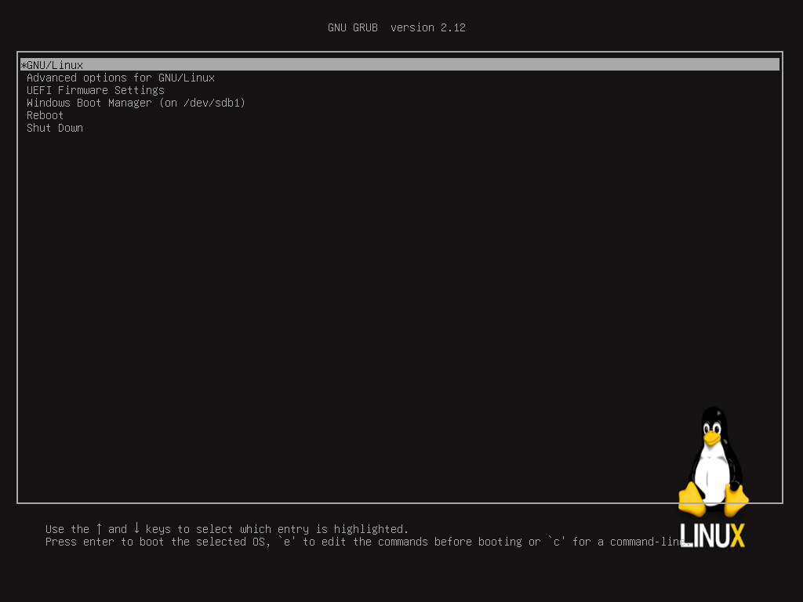

# Automated Linux From Scratch 12.1 (SysV)

Tested with Debian 12 Bookworm:
- CPU 4 cores (Intel(R) Core(TM) i5-8259U CPU @ 2.30GHz), RAM 4GB, swap 3GB.
- CPU 3 cores (Intel(R) Core(TM) i5-5575R CPU @ 2.80GHz), RAM 4GB, swap 3GB.

Target: x86_64 architecture with UEFI

*This project is based on the Official LFS 12.1 Book*

https://www.linuxfromscratch.org/lfs/view/12.1/

## Package Requirements

Add the following packages 

```
sudo apt install gcc g++ make patch bison gawk git htop texinfo file dosfstools gettext
```

Set these Enviornment Variables

```bash
export LFS=/mnt/lfs
export ALFS=/mnt/lfs/alfs
```

## LFS Partition

| :warning: wipes the /dev/sdb drive |
| --- |

- Create a new empty GPT partition table (option g)
- Create a new vfat parition **/dev/sdb1** (option n, 150MB) for EFI
- Create a new ext4 parition **/dev/sdb2** (option n, 1GB) for boot
- Create a new ext4 parition **/dev/sdb3** (option n) for root
- Create a new swap parition **/dev/sdb4** (option n, 4GB) for swap

```bash
sudo fdisk /dev/sdb
sudo mkfs.vfat -v /dev/sdb1
sudo mkfs -v -t ext4 /dev/sdb2
sudo mkfs -v -t ext4 /dev/sdb3
sudo mkswap /dev/sdb4
```

Mount new partitions

```bash
sudo mkdir $LFS
sudo mount -vt ext4 /dev/sdb3 $LFS
sudo mkdir $LFS/boot
sudo mount -vt ext4 /dev/sdb2 $LFS/boot
sudo mkdir $LFS/boot/efi
sudo mount -vt vfat /dev/sdb1 -o codepage=437,iocharset=iso8859-1 $LFS/boot/efi
```

## Prepare Host

Grab the alfs project files

```bash
sudo git clone https://github.com/vuonglequoc/alfs.git $ALFS
```

Change directory to alfs

```bash
cd $ALFS
```

Verify required programs

```bash
sudo $ALFS/scripts/version_check.sh
```

Download toolchain source code from wget-list

```bash
sudo -E $ALFS/scripts/get_packages.sh
```

Setup the LFS user environment

```bash
sudo -E $ALFS/scripts/setup_lfs_env.sh
```

## Build Toolchain

These scripts are required to run as the new lfs user

```bash
sudo su lfs
# build 30 minutes
$ALFS/scripts/compile_cross-toolchain.sh
# build 35 minutes
$ALFS/scripts/cross-compile_temp-tools.sh
exit
```

## Build LFS System

Run as root with environment variables set earlier

```bash
# build 11 minutes
sudo -E $ALFS/scripts/chroot_build_addtemp-toolchain.sh
# backup 32 minutes
sudo -E $ALFS/scripts/backup_temp-toolchain.sh
# build 6 hours 8 minutes
#   gcc 3 hours
sudo -E $ALFS/scripts/chroot_build_basic_system_software.sh
# build <1 minutes
sudo -E $ALFS/scripts/chroot_system_configuration.sh
# build 15 minutes
sudo -E $ALFS/scripts/chroot_make_system_bootable.sh
```

## Grub Bootloader

Below is how I installed GRUB with UEFI support while inside the chrooted LFS system

https://www.linuxfromscratch.org/blfs/view/12.1/postlfs/grub-efi.html

Consider reading the LFS book for backing up your bootloader.

https://www.linuxfromscratch.org/lfs/view/12.1/chapter10/grub.html

| :warning: make certain you are in chroot |
| --- |

```bash
sudo -E $ALFS/extras/chroot.sh /dev/sdb3
mountpoint /sys/firmware/efi/efivars || mount -v -t efivarfs efivarfs /sys/firmware/efi/efivars
```

Prepare background

```bash
mkdir /boot/grub/images/
cp /alfs/defaults/boot/grub/images/splash.png /boot/grub/images/splash.png
```

Updating grub defaults for boot menu with background

```bash
cp /alfs/defaults/etc/default/grub /etc/default/grub
```

Add menu entry for Windows and helpful Reboot, Shutdown

```bash
cp /alfs/defaults/etc/grub.d/40_custom /etc/grub.d/40_custom
```

Make `grub.cfg` with grub-mkconfig instead of typing manually.

```bash
grub-install --target x86_64-efi --bootloader-id=LFS --recheck
efibootmgr | cut -f 1
grub-mkconfig -o /boot/grub/grub.cfg
```

Exit chroot environment

```bash
umount efivarfs
exit
```

Backup final OS

```bash
# backup 35 minutes
sudo -E $ALFS/scripts/backup_os.sh
```

Un-mount LFS partitions

```bash
cd /home
sudo umount $LFS/boot/efi
sudo umount $LFS/boot
sudo umount $LFS
```

At this step, we have a basic LFS system that can boot and play around with bash shell.



## BLFS

### Remote environment

Prepare remote environment with OpenSSH to use LFS system efficiently to install other packages instead of chroot environment.

Mount LFS partitions

```bash
sudo mount -vt ext4 /dev/sdb3 $LFS
sudo mount -vt ext4 /dev/sdb2 $LFS/boot
sudo mount -vt vfat /dev/sdb1 -o codepage=437,iocharset=iso8859-1 $LFS/boot/efi
```

Enter chroot environment and build software for remote environment

```bash
sudo -E $ALFS/scripts/chroot_build_remote_software.sh
```

From now on, we can use LFS system remotely for other installation with user **user** and pass **user**.

### Post LFS Configuration and Extra Software

```bash
sudo /alfs/scripts/build_post_lfs.sh
```

### General Libraries and Utilities

```bash
sudo /alfs/scripts/build_general_utilities.sh
```

### Networking

```bash
sudo /alfs/scripts/build_networking.sh
```

### Multimedia

```bash
sudo /alfs/scripts/build_multimedia.sh
```

Using sample:

```bash
# Play audio
ffplay music.mp3
nvlc music.mp3
mpv music.mp3

# Play video without sound
sudo ffmpeg -re -i ${VIDEO} -filter:v scale=1024:-1 -c:v rawvideo -pix_fmt bgra -f fbdev /dev/fb0

# Play video with sound
sudo ffmpeg -re -i ${VIDEO} -filter:v scale=1024:-1 -c:v rawvideo -pix_fmt bgra -f fbdev /dev/fb0 > ${VIDEO}_video.log 2>&1 < /dev/null &
ffplay ${VIDEO} -autoexit > ${VIDEO}_sound.log 2>&1 < /dev/null &

# Play Youtube video + sound with yt-dlp
# Need to install yt-dlp
./yt-dlp ${VIDEO_URL} -o - 2>/dev/null | tee >(sudo ffmpeg -re -i - -filter:v scale=1024:-1 -c:v rawvideo -pix_fmt bgra -loglevel quiet -f fbdev /dev/fb0) >(ffplay -autoexit -loglevel quiet -) >/dev/null

# Adjust audio Volume
sudo alsamixer
```

### Graphical Components: X + Window Managers

TODO: Xfce Desktop

### X Software

TODO: Office, Web Browser

## Extra Scripts

Confirm that LFS and ALFS environment variables are both set and LFS partition is mounted.

Re-enter chroot and pass partition

```bash
sudo -E $ALFS/extras/chroot.sh /dev/sdb3
```

Emulate the LFS system with QEMU (pass drive)

```bash
sudo -E $ALFS/extras/qemu.sh /dev/sdb
```

Emulate the LFS system with QEMU + graphics (pass drive)

```bash
sudo -E $ALFS/extras/xqemu.sh /dev/sdb vmware
```

## Notes

The root password in the LFS chrooted system is **root**.

### LFS User

The lfs user on the host system can be deleted with `sudo deluser lfs` the lfs user */home/lfs* folder can also be removed. It is only required to build the first toolchain.

### GCC compile need high stack size

Before building the package, increase the stack size

```bash
ulimit -s 32768
```

### Glibc compile need high RAM

- Tested with CPU 4 cores, RAM `4GB`, swap `3GB` -> OK

### Kernel Panic

This can happen if you are trying to boot from qemu and the entry for **root=/dev/???** is not **sda** 

Simply edit `vi /boot/grub/grub.cfg` and change root references to sda1

```bash
root=/dev/sda1
```

When I am booting from my physical server I had to set it back to sdb3, because sda is my primary Debian installation.

```bash
root=/dev/sdb3
```

### References

*Linux From Scratch 12 Book*: https://www.linuxfromscratch.org/lfs/view/12.1/

*Beyond Linux From Scrach 12 Book*: https://www.linuxfromscratch.org/blfs/view/12.1/

*Windy's ALFS*: https://github.com/mattwind/alfs

### Knowledge

**GNU toolchain**: https://en.wikipedia.org/wiki/GNU_toolchain

**How a toolchain is constructed**: https://crosstool-ng.github.io/docs/toolchain-construction/

**Linux Booting Process**:
- https://en.wikipedia.org/wiki/Booting_process_of_Linux
- https://www.freecodecamp.org/news/the-linux-booting-process-6-steps-described-in-detail/
- https://learn.adafruit.com/running-programs-automatically-on-your-tiny-computer/sysv-init-runlevels

1. System startup (BIOS): search, load, execute boot loader program
  - default: EFI/BOOT/BOOTX64.EFI
  - GRUB: EFI/grub/grubx64.efi
  - custom: EFI/LFS/grubx64.efi (same as GRUB)
2. Bootloader stage (GRUB): load kernel image /boot/vmlinuz-*
3. Kernel: execute /sbin/init with configuration in /etc/inittab
4. Init (SysV): execute init scripts in /etc/rc.d/rcS.d/ then /etc/rc.d/rc[run level].d/ (symlink -> /etc/rc.d/init.d/*).
  - Run level 0: /etc/rc.d/rc0.d/ : Power off
  - Run level 1: /etc/rc.d/rc1.d/ : Rescue (single-user)
  - Run level 3: /etc/rc.d/rc3.d/ : Multi-user with networking (default)
  - Run level 5: /etc/rc.d/rc5.d/ : level 3 + Graphical
  - Run level 6: /etc/rc.d/rc6.d/ : Reboot

    For Run level from 1 to 6, final step is execute /sbin/agetty to opens a tty port, prompts for a login name and invokes the /bin/login command.

    After a successful login, an interactive login shell is started.

    Interactive login shell was defined in /etc/passwd. (root:x:0:0:root:/root:**/bin/bash**)

    The /etc/shadow file stores user passwords in Linux.

  From now on, we can interact with linux system by interactive login shell.
